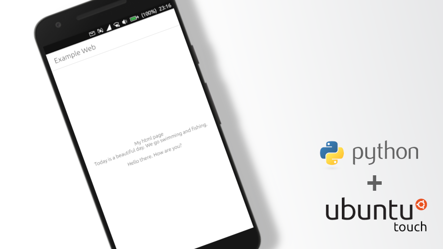

Working with Web Content with Python on Ubuntu Touch

# Working with Web Content with Python on Ubuntu Touch
Sometimes an application requires the ability to work with web content. It's like a chat, an RSS parser or a client version of the site. In this example, we'll look at the simplest way to handle a GET request.

**Let's create a new project in Clickable**, enter the command in the terminal:
    
    clickable create
	
Select the Python project type and fill in: 
Title \[App Title\]: Example Web 
App Name \[appname\]: example-web

We remove all unnecessary in Main.qml and bring it to the form:

    Page {
        anchors.fill: parent

        header: PageHeader {
            id: header
            title: i18n.tr('Example Web')
        }

        Label {
            id: label1
            anchors {
                top: header.bottom
                left: parent.left
                right: parent.right
                bottom: parent.bottom
            }
            text: 'Get Web'
            verticalAlignment: Label.AlignVCenter
            horizontalAlignment: Label.AlignHCenter
        }
    }
	
Let's add a Python object:

    Python {
        id: python
        Component.onCompleted: {
            addImportPath(Qt.resolvedUrl('../src/'));

            importModule('example', function() {
                python.call('example.speak',[], function(returnValue) {
                    console.log(returnValue);
                    label1.text=returnValue;
                })
            });
        }

        onError: {
            console.log('python error: ' + traceback);
        }
    }
	
Thus, after executing the Python code, we will output this content to the Label.
Now go to the src folder and edit **example.py**:

    import urllib3

    def speak():
      http = urllib3.PoolManager()
      try:
        source = http.request('GET', 'http://webcode.me')
      except Exception as e:
        return str(e)
      else:
        html_str = source.data.decode('utf-8')
        return html_str

Now if we run this code on the phone, we will get an error:

    HTTPConnectionPool(host='webcode.me', port=80): Max retries exceeded with url: / (Caused by NewConnectionError('<urllib3.connection.HTTPConnection object at 0xa8111390>: Failed to establish a new connection: [Errno -3] Temporary failure in name resolution',))
	
All this is connected with the protection of Ubuntu Toch from the fact that applications do not do too much 😁
Find **.Apparmor** in the project folder and add new privileges (permissions) to it:

    {
        "policy_groups": [
            "content_exchange",
            "content_exchange_source",
            "networking",
            "webview"
        ],
        "policy_version": 16.04
    }
	
Although this file is in JSON format, for some reason the number of spaces is important here. Therefore, if some permissions are not received by your application, then check the spaces or write them on one line.

We can now compile and run our program.

